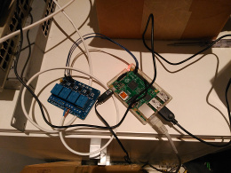
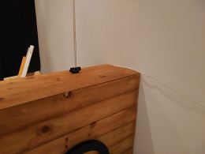
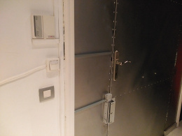

Zuul: The Abiquo Gatekeeper
===========================

Zuul is a small API used to open the office door. It runs on a Raspberry Pi
and sends a signal to the appropriate GPIO pin when the "open door" command is
issued. This way wa can keep working on our shit without having to traverse the
office everytime someone rings.

  

Prerequisites
-------------

Zuul is written in Go, so you'll need to have [Golang](https://golang.org/) installed and configured.

You will also need to install [eSpeak](http://espeak.sourceforge.net/) if you want to be able to use the text to speech features.

Compiling
---------

Zuul can be compiled as follows:

    make install

This will download all required dependencies, build and install the `zuul` binary in `$(GOPATH)/bin`.

License
-------

This sowftare is licensed under the Apache License 2.0. See LICENSE file for details.
